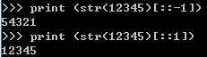

# 基本语法1
## 1.1矩阵Mat的用法

* Mat[:,0]就是取矩阵Mat的所有行的第0列的元素，

* Mat[:,1] 就是取所有行的第1列的元素。 

* Mat[:,  m:n]即取矩阵Mat的所有行中的的第m到n-1列数据，含左不含右。

* Mat[0,:]就是取矩阵X的第0行的所有元素，

* Mat[1,:]取矩阵X的第1行的所有元素。

## 1.2 解决递归溢出的方法
* 方法：通过尾递归优化，尾递归是指，在函数返回的时候，调用自身本身，并且，return语句不能包含表达式。这样，编译器或者解释器就可以把尾递归做优化，使递归本身无论调用多少次，都只占用一个栈帧，不会出现栈溢出的情况。


## 1.3 切片操作
* 起始位置:终止位置:遍历步长
：：1表示复制原字符串；
：：-1表示倒序复制原字符串




## 1.4 sorted
* sorted是从小到大排列的


## 1.5 返回函数
* 闭包函数：函数体内含有函数，外部函数可以返回内部函数，每次调用都会返回一个新的函数，两个函数申明相同的函数，即使内部的参数相同，其还是不相等的。
* 重点：返回函数不要引用任何循环变量，或者后续会发生变化的变量

## 1.6 匿名函数lambda
* 如lambda x:x*x  冒号前面的x表示函数参数
* 匿名函数没有返回值，也不用写函数名

## 1.7 装饰器
* 其作用就是对将要执行的函数进行修饰，但又不会修改函数的定义。
* @functools.wraps(func)    #阻止wrapper获取func的名称

## 1.8作用域
* 类似_xxx和__xxx这样的函数或变量是非公开的，不应该被直接引用，我们可以申明一个公共函数调用


## 1.9字典
```
d={key1:value1,key2:value2}
```
* 以键值对的形式存放，一般key是不会改变的，改变的只是后面的值

## 1.10reduce函数
* reduce函数会对参数序列中元素进行累积，定义：reduce(function, sequence[, initial]) -> value。

```
reduce(lambda x,y:x+y,[1,2,3,4])
10
reduce(lambda x,y:x+y,[1,2,3,4],10)
20
```

* 如果没有initial参数，这么算：（（（1+2）+3）+4）

* 如果有initial参数，这么算： （（（（10+1）+2）+3）+4）

## 1.11re包
1. re是正则表达式的意思，且re为python自带的模块。

2. 分为贪婪模式：匹配尽可能多的字符

3. 和非贪婪模式：匹配尽可能少的字符

4. 有多种方法可以使用。如：split方法：分割字符串，match方法：只匹配位于字符串开始位置的模式串，

5. 还有 search方法：搜索所有位置匹配的模式串，但只返回第一个匹配到的

## 1.12zip函数
* zip函数用于将可迭代的对象作为参数，将对象中对应的元素打包成**一个个元祖**，然后返回由这些**元组组成的列表**

* 如果各个迭代器的元素个数不一致，则返回**列表长度与最短的对象相同**

* 利用*号操作符，可以将元组解压为列表
