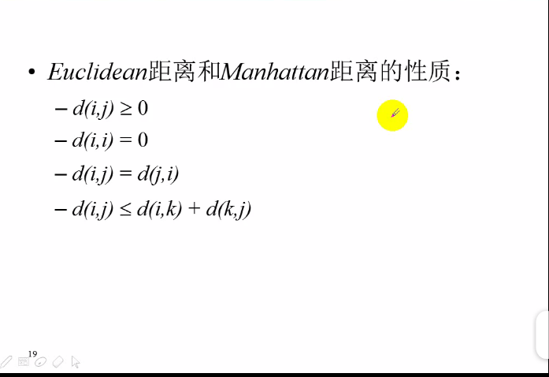
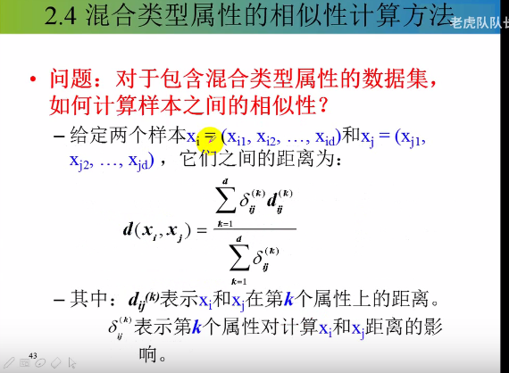

# 聚类

* **定义：**

    

* **作用 :**
    * 作为一个独立的工具来获得数据集中数据的分布情况
    
    * 作为其他数据挖掘算法的预处理步骤
        * 首先，对数据进行聚类--粗分类
      
        * 然后，分别对每个簇进行特征提取和细分类，可以有效提高分类精度

     

* **分析：**

    

* **连续型属性**

* **二值离散型属性**

 
 
   * **对称的属性：** 
       * 男和女
       * 上和下
       * 左和右
       * 进和出
 

**多值离散型属性**

**混合类型属性**

* mi是簇Ci的平均值

  

  
  

