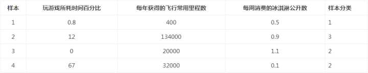
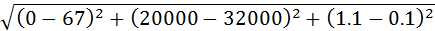

# k近邻
* 思路
* 公式
* 算法描述
* 数据归一化

**1. 思路： 就是在训练集中数据和标签已知的情况下，输入测试数据，将测试数据的特征与训练集中对应的特征进行相互比较，找到训练集中与之最为相似的前K个数据，则该测试数据对应的类别就是K个数据中出现次数最多的那个分类。**

**2.公式**


**3.算法的描述为：**

    计算测试数据与各个训练数据之间的距离；
    
    按照距离的递增关系进行排序；
    
    选取距离最小的K个点；

    确定前K个点所在类别的出现频率；
    
    返回前K个点中出现频率最高的类别作为测试数据的预测分类。

**4. 数据归一化**

表中给出了4组数据，要计算样本3和样本4之间的距离，可以使用欧式距离公式计算


计算公式如下：



其中，样本容量大的对最后的结果产生的影响很大，我们这时就必须考虑数据归一化的方法，限制特征值的样本大小。
如可以将取值范围设置在0到1或-1到1之间。公式如下：

**newValue = (oldValue - min) / (max - min)**

其中min和max分别是数据集中的最小特征值和最大特征值

差平方公式： (a+b)*(a-b)


**5.代码详解**
```
sqDiffMat = diffMat.A ** 2
```
* diffMat是一个matrix对象，而sqDiffMat是一个ndarray对象 
* 区别：
    * 1.两者关于秩的区别：matrix对象的shape只能是二维的，如（1，3），而ndarray对象的shape可以是多维度的，如（3，），（1，1，1，1，6）。  
   * 2.生成方式的不同：生成matrix对象使用的是np.mat()方法，这个方法的参数data可以是列表和元祖的任意混合嵌套，字符串，ndarray对象。
   * 3.运算的区别：matrix对象的两个矩阵相乘，是线性代数中的矩阵乘法，而ndarray对象的两个对象相乘，是两个对象的点乘，即相同位置的元素相乘。
   * 4.两个对象之间可以相互转化：从ndarraydaomatrix用np.mat()；从matrix到ndarray用np.asarray()