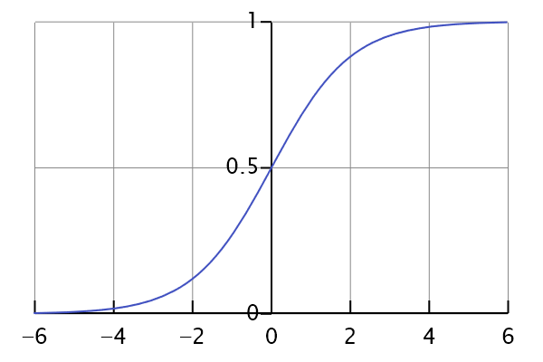

# logistic回归
* logistic的定义
* logistic的模型
* 代价函数

## 1.logistic的定义

**1.从大的类别上来说，逻辑回归是一种有监督的统计学习方法，主要用于对样本进行分类。**
对于逻辑回归，输入可以是连续的[-∞, +∞]，但输出一般是**离散的**，即**只有有限多个输出值**。

例：其输出的值域可以只有两个值{0, 1}，这两个值可以表示对样本的某种分类，高/低、患病/健康、阴性/阳性等，这就是最常见的二分类逻辑回归。

## 2.logistic的模型
**1.logistic模型**

$$h_{\theta}(x) = g(\theta^{T}x) = \frac{1}{1+e^{-\theta^{T}x}}$$

其中$x$为样本，$x = [x_1,x_2,\cdots,x_n]$ 为n维向量，函数g为logistic函数，g的一般公式为:

$$g(z) = \frac{1}{1+e^{-z}}$$
这个函数又是我们的sigmoid函数，这个函数的作用就是将我们$h(\theta)$的输出范围定在 （0，1）之间。

$p(y = 1|x)$表示当一个$x$发生时，$y$被分到1的概率大小。我们上面的图可以看出$y$的取值范围是在（0，1）之间，为了能够弄清楚将$x$分为哪一个类别，我们需要设定一个阈值，这里直接设定为$y=0.5$ 作为我们的分界线，而当$y>=0.5$的这边，就将$x$归为1之一类，$y<0.5$的就将$x$归为0这一类。

## 3. 线性判别分析（LDA）
* 思想：给定训练样本集，设法将样本投影到一条直线上，使得同类样本的投影点尽可能接近，异类样本点的投影点尽可能远离

## 4. 随机梯度上升
* 由于梯度上升算法在每次更新回归系数时都需要遍历整个数据集，若数据集过大计算复杂度就太高了，所以需要对其进行改进
* 改进方法是一次仅用一个样本点来更新回归系数，也就是随机梯度上升算法。
* 由于可以在新样本到来时对分类器进行增量式更新，因而随机梯度上升算法是一个在线学习算法。

## 5.数据预处理
* 缺失类标：在测试数据集中发现一条数据的类别标签已经缺失，就直接将这条数据丢弃。
* 在logstic中这种做法是合理的，但不能够使用在KNN类似的算法中