# 线性回归

## 0.先导知识点
* **学习线性回归的方程**
* **学习梯度下降算法**
* **学习多元线性回归方程**
* **学习正常方程算法**

## 1. 提出线性回归方程
**利用房屋数据集来预测出现有房屋的价格**

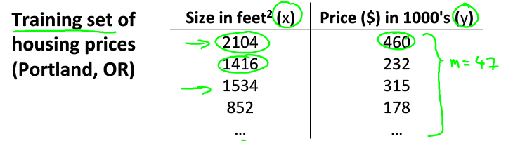

首先，在上述图中可以看出一个变量X，而变量Y与X可以用线性回归方程来表示，选择学习的算法，这里直接选择用线性回归算法

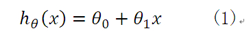
 
因为这个方程还不能够确定它是否符合数据之间的关系，所以我们直接假设它成立

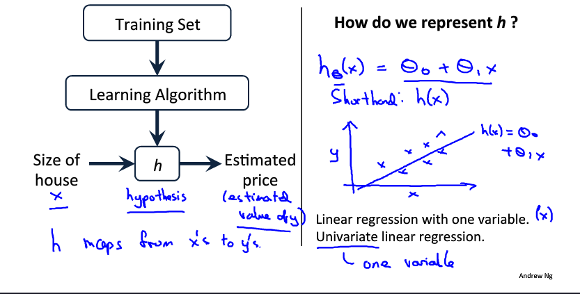

这里的假设方程有两个变量 θ1与θ2 

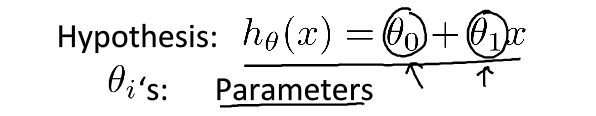

其次，为了使我们构造的假设方程贴近于我们的实际中的值，还需要构造一个代价方程，这里的代价方程的作用是将预测值向实际值靠近，也就是寻找 θ1与θ2 的值，是代价方程的值最小。 寻找到我们假设函数的最优方程.

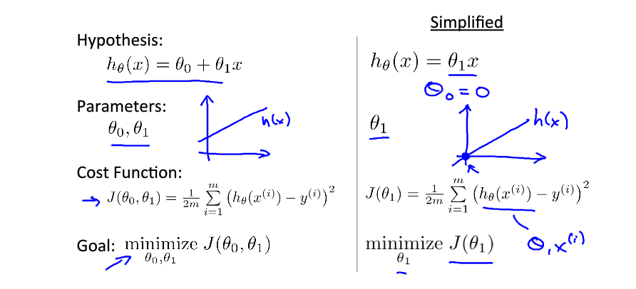

现在，我们的目标是先在一个变量的情况下找到代价函数的最优解，画图最为清晰，变量只有一个，也就是在一维的平面上的图。

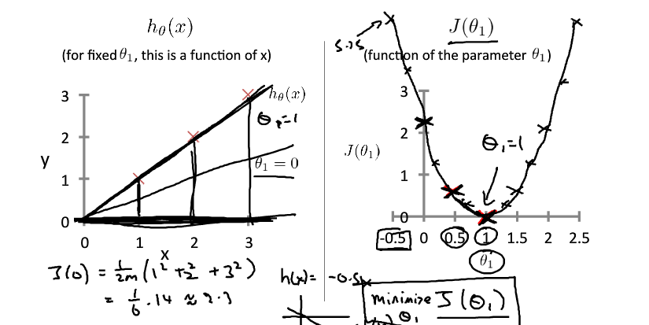

在完成一个变量的代价方程之后，就将变量的个数升到两个变量的线性回归方程了 

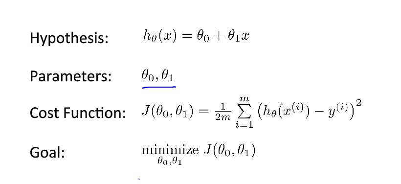

我们还是将两个变量不同的值赋给代价方程，但这次生成的图形为3D等高线图

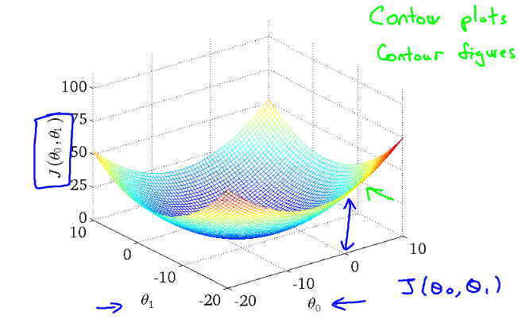

但是在这种图形下寻找最优解比较的困难，所以我们在这里引进了梯度下降的算法，为了求出min J( θ1,θ2)

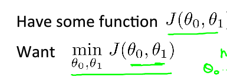
         
值得注意的是，这里我们只能够求出局部的最优解，在每个不同的点上的最优解可能不一样。
解决方法：取多组不同的参数进行计算，以免一组参数导致找到局部最优解。

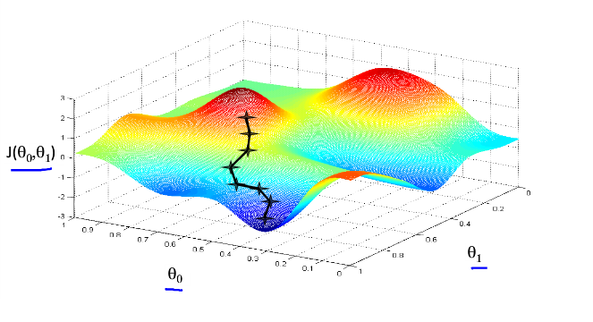

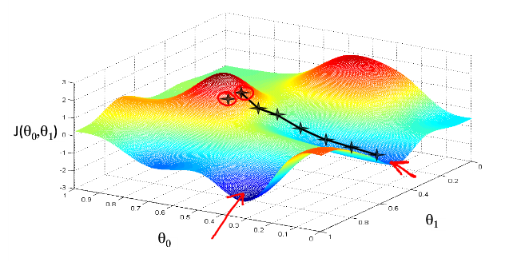

## 2.梯度下降算法
千万注意梯度下降算法的正确使用方法，

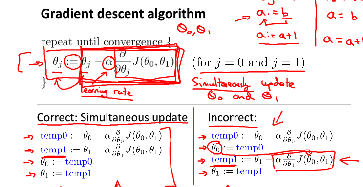

梯度下降算法的原理:利用导数的概念，不断地迭代求代价函数的最小值,也就是对变量求偏导数，当偏导数等于0时，可能就是我们要找的值了。

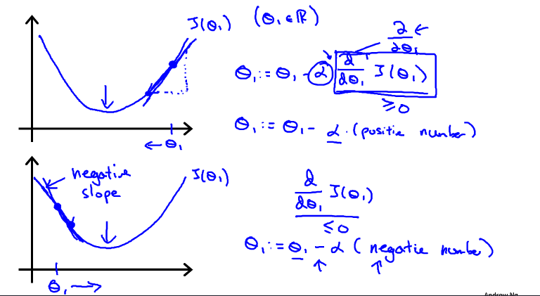

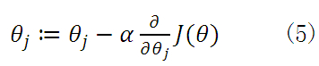

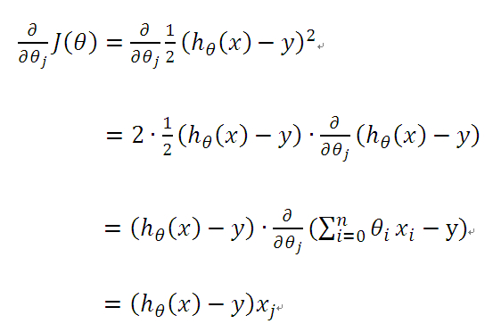

现在讨论一下a的取值，a的值太大或太小都不行 ,a太小了可能会进行多次的迭代，效率低下，而a太大了也会导致求不出最优解，直接略过了。
a被称之为学习率，取值在[0，1]之间
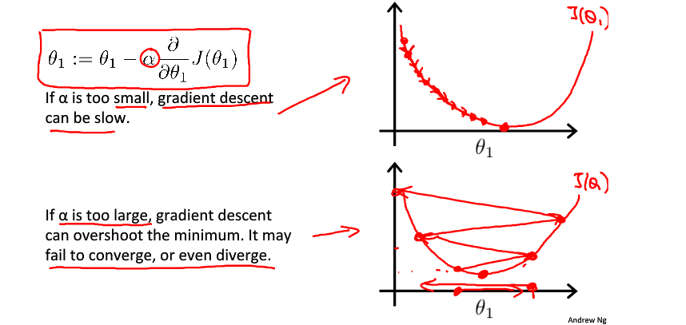
    
并且，在不断迭代的过程中，梯度值会不断的变小，所以θ1的速度会不断的变慢，所以不需要a的值越来越小

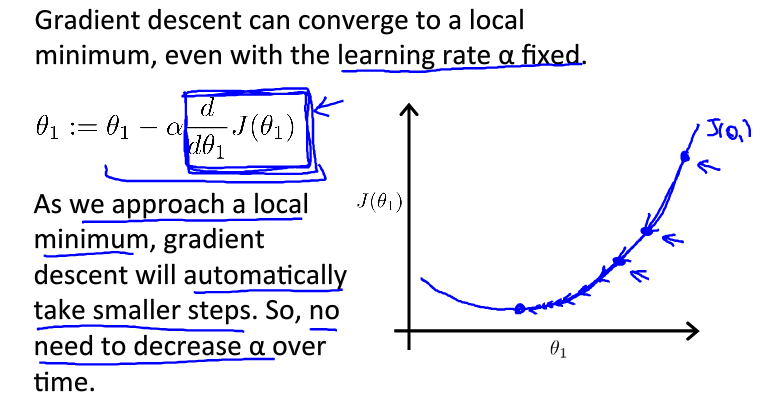

当梯度下降到一定数值后，每次迭代的变化很小，这时可以设定一个阈值，只要变化小于该阈值，就停止迭代，而得到的结果也近似于最优解。
为了选择参数a，就需要不断测试，因为a太大太小都不太好。

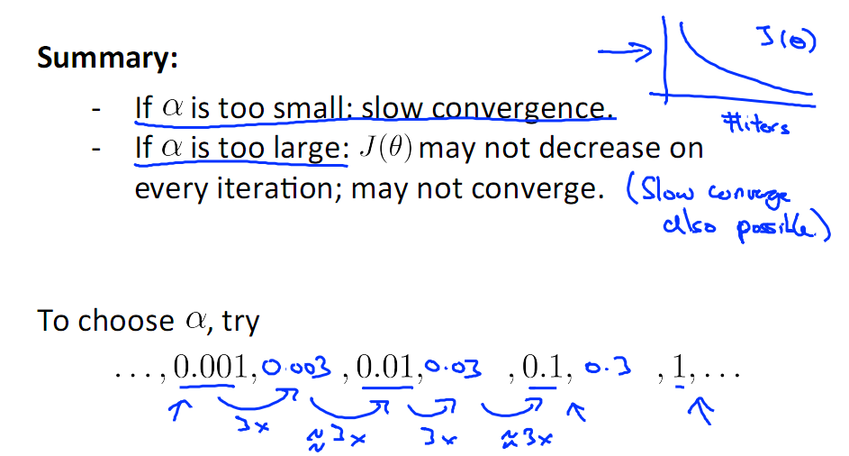

选择好了a之后，就可以进行计算了。

## 3.多元线性回归方程
在n>=2 的时候我们就要考虑多元回归方程了，但由于变量个数（特征个数）太多，样本太多，所以我们采用矩阵相乘的求解方法。
分清楚矩阵还是向量。

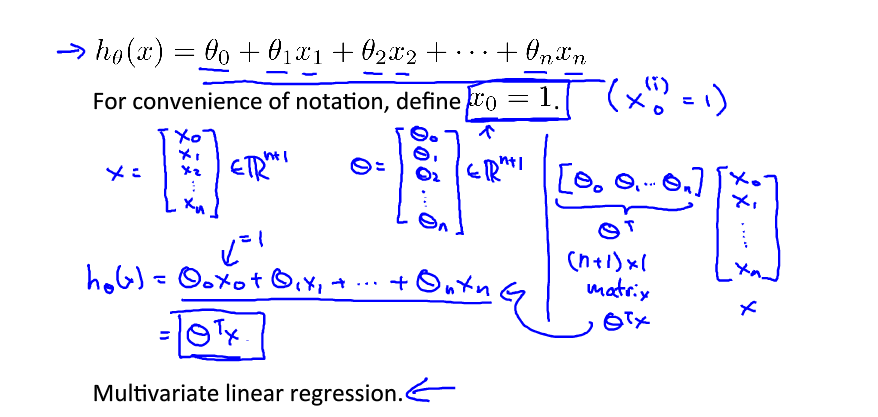

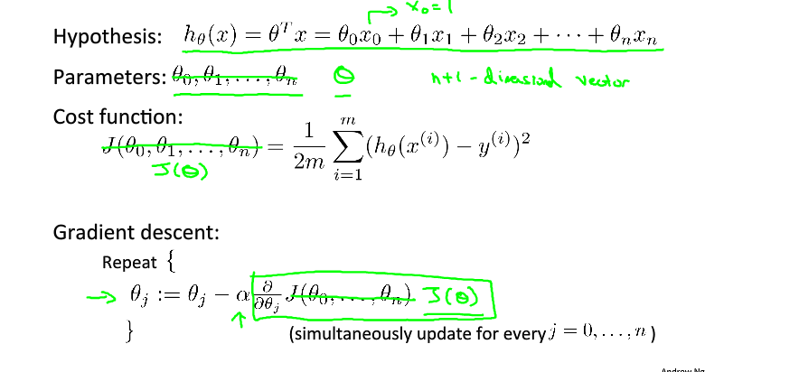

多元下的梯度下降算法就需要改变了 。

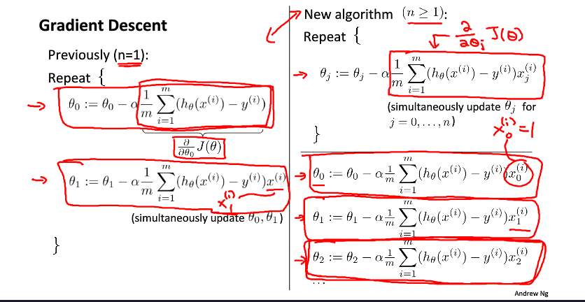

相信这张图可以完美的表示，偏导数的计算推导过程

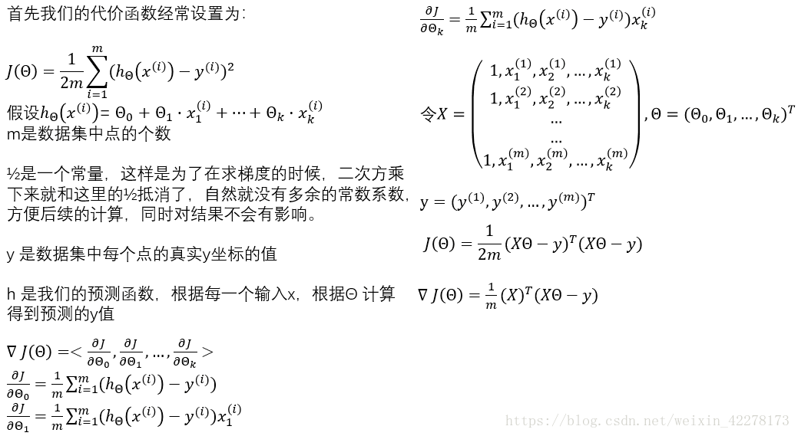

我们这里还需要考虑一个问题，就是特征值的取值，如果特征值取值过大，则迭代次数上升，过小也不行，接下来有两种方法可以避免出现这种情况。
1.特征缩放，直接除以特征值的最大值

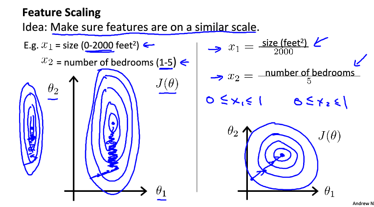

这里有个标准就是

2.均值归一化法(Mean normalization)，特征值减去平均值，再除以最大值

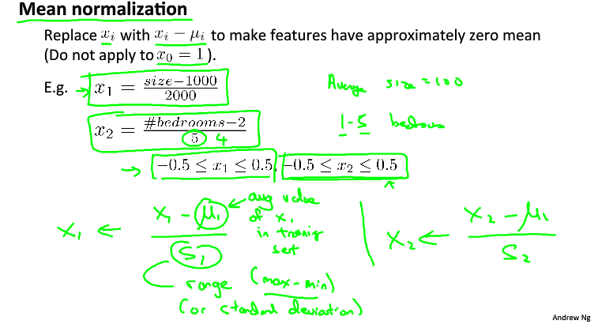

***
## 4.正常方程算法（Normal Equation）
我们在特征数还不多的时候可以选择使用这个方法，比较方便。

1.当 $\theta\in R$  时，代价函数为 

$$J(\theta)=a\theta^2+b\theta+c$$
此时只需要对$\theta$求导数，使其导数为0即可求出 $\theta$  :

$$Let \quad \frac{\partial}{\partial\theta}J(\theta)=0$$

2.当 $\theta\in R^{n+1}$ 时，代价函数为

$$ J(\theta_0,\theta_1,...,\theta_n)=\frac{1}{2m} \sum_{i=1}^m (h_\theta(x^{(i)})-y^{(i)})^2$$

然后对每个$\theta$ 求偏导数，并使其等于0，即可以求出$\theta$的值 

$$Let \quad \frac{\partial}{\partial\theta_j}J(\theta)=0 \quad(j=0,1,2,...,n)$$

接下来看一个例子：房价预测

|       | **Size($feet^2$)** | **Number of bedrooms** | **Numbers of floor** | **Age of house(years)** | **price(￥1000)** |
| :---: | :----------------: | :--------------------: | :------------------: | :---------------------: | :---------------: |
| $x_0$ |       $x_1$        |         $x_2$          |        $x_3$         |          $x_4$          |        $y$        |
|   1   |        2104        |           5            |          1           |           45            |        460        |
|   1   |        1416        |           3            |          2           |           40            |        232        |
|   1   |        1534        |           3            |          2           |           30            |        315        |
|   1   |        852         |           2            |          1           |           36            |        178        |

为了方面我们的运算，我们将表格中的数据按照矩阵的方式表示出来

$$X=\left[
\begin{matrix} 1&2104&5&1&45\\
1&1416&3&2&40\\
1&1534&3&2&30\\
1&852&2&1&36\\
\end{matrix}
\right];\quad
y=\left[
\begin{matrix} 460\\232\\315\\178\\
\end{matrix}
\right]$$
上面的X为一个$4\times5$的矩阵，而y则是个$4\times1$的向量。

***

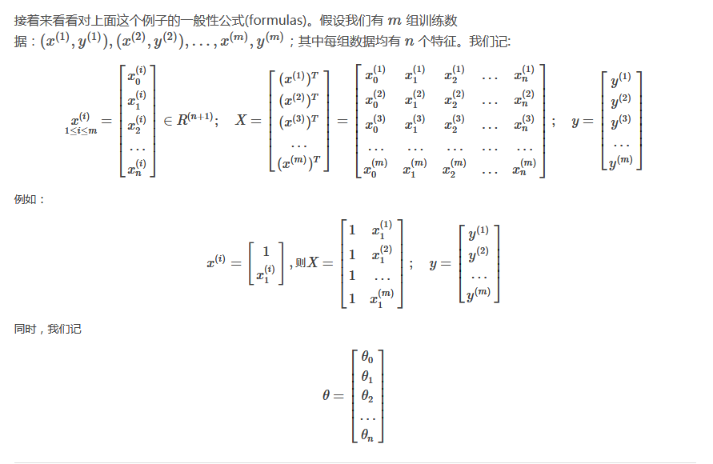

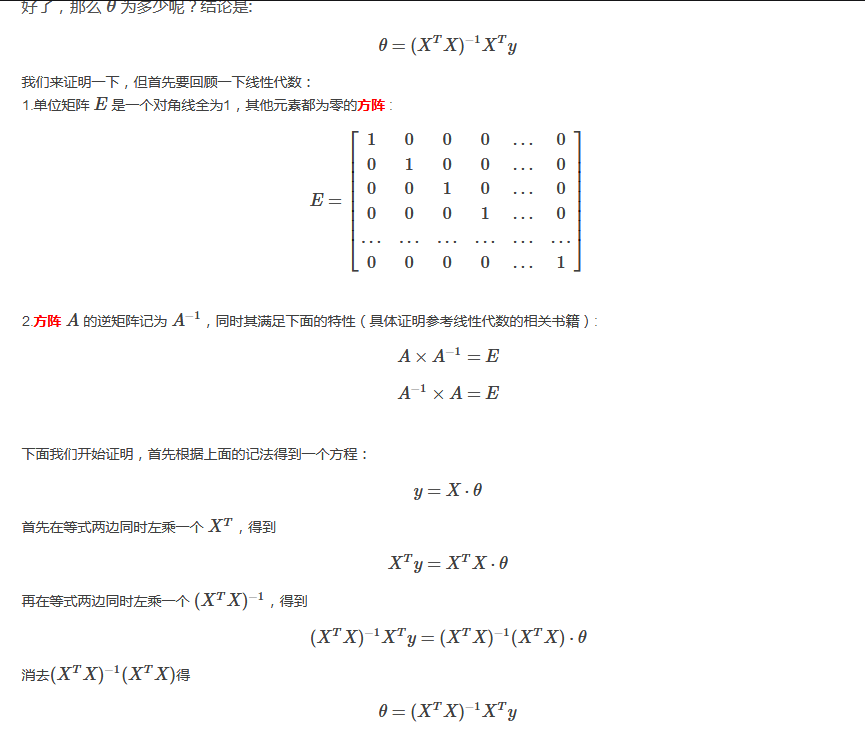

## 5.梯度下降算法与正常方程算法之间的比较
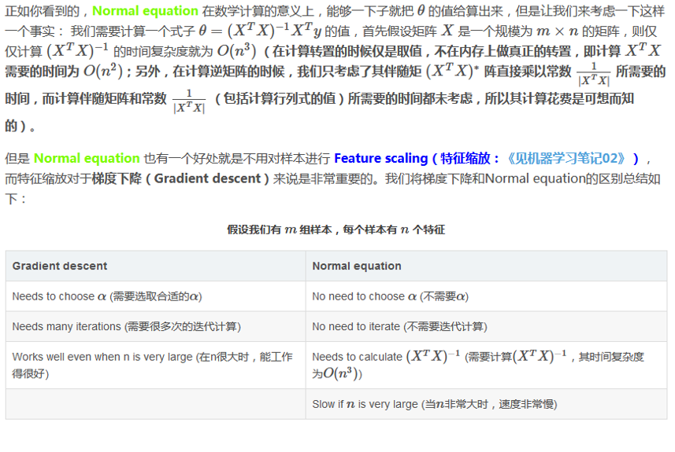

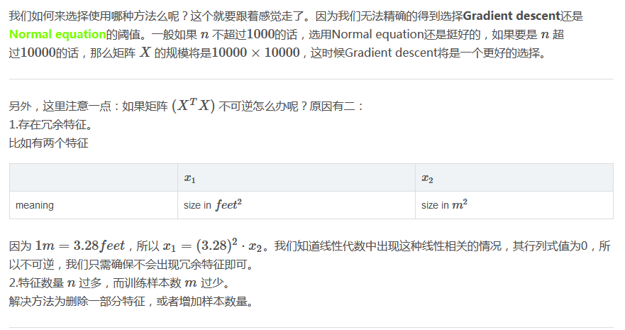